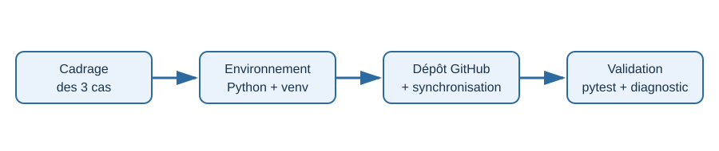
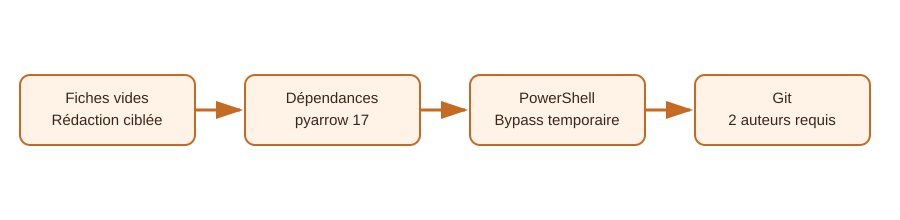

# Journal technique — TP1

## 1. Contexte

Le TP1 avait pour objectif de cadrer une application d'intelligence artificielle,
de préparer un environnement Python reproductible et de publier le projet sur
GitHub pour un travail en binôme.

Le projet retenu pour la suite est un agent de recherche documentaire utilisant
une approche RAG. Le dépôt contient toutefois les trois cas de cadrage demandés
par le TP1.



## 2. État final

- Les trois fiches de cadrage sont complètes.
- Une seule approche est sélectionnée dans chaque fiche.
- Les justifications citent au moins deux critères de décision.
- L'environnement Python 3.11 est créé dans `.venv`.
- Les dépendances principales sont installées.
- `requirements.lock` est généré.
- Le projet est publié sur GitHub, branche `main`.
- Le dépôt distant est synchronisé et l'arbre de travail est propre.
- Le dernier contrôle a donné 37 tests réussis sur 38 ; le test restant attend
  un commit réalisé par le deuxième membre du binôme.

## 3. Problèmes rencontrés et solutions

### 3.1 Fiches de cadrage vides

**Symptôme :** les trois fichiers de cadrage contenaient seulement le modèle,
et les tests de cadrage échouaient.

**Cause :** les rubriques obligatoires n'avaient pas encore été rédigées.

**Solution :** rédaction des rubriques suivantes pour chaque cas :

- besoin ;
- utilisateur final ;
- approche retenue ;
- justification ;
- données nécessaires ;
- métrique de succès ;
- conséquence d'une erreur ;
- risques éthiques et confidentialité.

Une seule approche a été cochée par fiche et les critères `(a)`, `(b)`, `(c)`
et `(d)` ont été cités dans les justifications.

### 3.2 Mauvais emplacement du projet

**Symptôme :** certains outils indiquaient que les fichiers n'existaient pas.

**Cause :** le kit contenait un dossier `sentiment-app` imbriqué dans le
dossier de travail. Le vrai projet se trouve dans :

```text
Tp1/Tp1/sentiment-app/sentiment-app/
```

**Solution :** utiliser systématiquement ce dossier comme racine du projet.

### 3.3 Exécution du script PowerShell bloquée

**Symptôme :**

```text
The file setup.ps1 cannot be loaded because it is not digitally signed
```

**Cause :** la politique d'exécution PowerShell bloque les scripts non signés.

**Solution utilisée pour la session :**

```powershell
Set-ExecutionPolicy -Scope Process -ExecutionPolicy Bypass
.\scripts\setup.ps1
```

Cette modification est limitée au processus PowerShell courant.

### 3.4 Conflit de dépendances Python

**Symptôme :**

```text
ResolutionImpossible
```

**Cause :** `pyarrow==21.*` était incompatible avec `mlflow==2.17.*`,
qui exige une version de `pyarrow` inférieure à 18.

**Solution :** remplacer la contrainte par :

```text
pyarrow==17.0.*
```

Les dépendances ont ensuite été installées et `requirements.lock` a été
généré avec les versions effectivement résolues.



### 3.5 Initialisation et publication Git

**Symptôme :** le projet n'était pas encore publié sur GitHub.

**Solution :**

```powershell
git init
git add -A
git commit -m "TP1 : cadrage et préparation de l'environnement"
git branch -M main
git remote add origin https://github.com/othmaneamaa/sentiment-app.git
git push -u origin main
```

Le README a ensuite été complété avec les informations de Othmane Amaadour et
Mohcine Errachid.

### 3.6 Test Git sur les auteurs de commits

**Symptôme :** 37 tests passaient, mais le test suivant échouait :

```text
test_each_member_has_committed
```

**Cause :** l'historique Git ne contenait encore qu'un seul auteur.

**Solution attendue :** Mohcine doit cloner le dépôt, configurer sa propre
identité Git et réaliser un commit depuis son compte :

```powershell
git config user.name "Mohcine Errachid"
git config user.email "son-adresse-email"
git add README.md
git commit -m "TP1 : vérification de l'environnement"
git push
```

Après synchronisation, la commande suivante doit afficher les deux auteurs :

```powershell
git shortlog -sn --all
```

### 3.7 Mention Copilot dans les contributeurs

**Symptôme :** une ligne `Co-authored-by: Copilot` avait été ajoutée au
dernier commit.

**Risque :** GitHub pouvait associer Copilot aux contributeurs du dépôt.

**Solution :** le dernier commit a été réécrit sans ce trailer, puis poussé
avec `--force-with-lease`. Le nouveau commit est :

```text
f62f2d3 README : ajout des membres du binôme
```

## 4. Vérifications réalisées

Commandes utilisées :

```powershell
python scripts\check_setup.py
.venv\Scripts\python.exe -m pytest -q
```

Résultat du dernier contrôle :

```text
37 passed, 1 failed
```

L'échec restant est volontairement lié au commit manquant de Mohcine ; il ne
concerne ni les fiches de cadrage ni l'environnement Python.

## 5. Leçons retenues

1. Toujours vérifier la racine réelle du projet avant d'exécuter les commandes.
2. Lire les contraintes entre dépendances avant de modifier leurs versions.
3. Utiliser un environnement virtuel pour rendre les installations reproductibles.
4. Ne jamais simuler le commit d'un autre membre du binôme.
5. Vérifier l'historique Git avec `git shortlog -sn --all`.
6. Utiliser `--force-with-lease` plutôt que `--force` pour une réécriture contrôlée.

## 6. Prochaine étape

Mohcine doit accepter l'invitation GitHub, cloner le dépôt et réaliser son
propre commit. Ensuite, le binôme pourra démarrer le projet RAG avec un corpus
de règlement intérieur et de documents administratifs d'une école.
